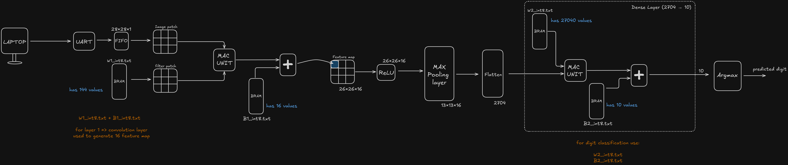

# CNN Accelerator for Real-Time Handwritten Digit Recognition

## Overview

This project implements a CNN accelerator in Verilog for real-time handwritten digit recognition on FPGA. Image data is received through UART, processed entirely in hardware, and the predicted digit is displayed on a seven-segment display.

The focus of this project was to build a working FPGA-based CNN and verify it in hardware. The design is functional but not fully optimized, and further improvements may be made in the future.


---

## Project Highlights

* Verilog-based CNN accelerator
* Streaming image processing architecture
* 16 parallel MAC units for convolution
* INT8 quantized weights and biases
* UART image transfer from host PC


---

## Architecture

<p align="center">
  
</p>

---

## Project Structure

```text
CNN-Accelerator-for-Real-Time-Handwritten-Digit-Recognition
│
├── rtl/
├── parameter/
├── simulation/
├── uart example/
├── python/
└── README.md
```
---
## Output Demonstration

<p align="center">
  
</p>

---

### Resource Utilization

The design was implemented on the Efinix Ti375 FPGA and uses approximately:

* 12,353 Logic Elements (~3.8%)
* 100 Memory Blocks (~3.7%)
* 137 DSP Blocks (~10.2%)

The design has been successfully synthesized and can operate at frequencies up to **100 MHz**.

---

## License

This project is released under the MIT License.


